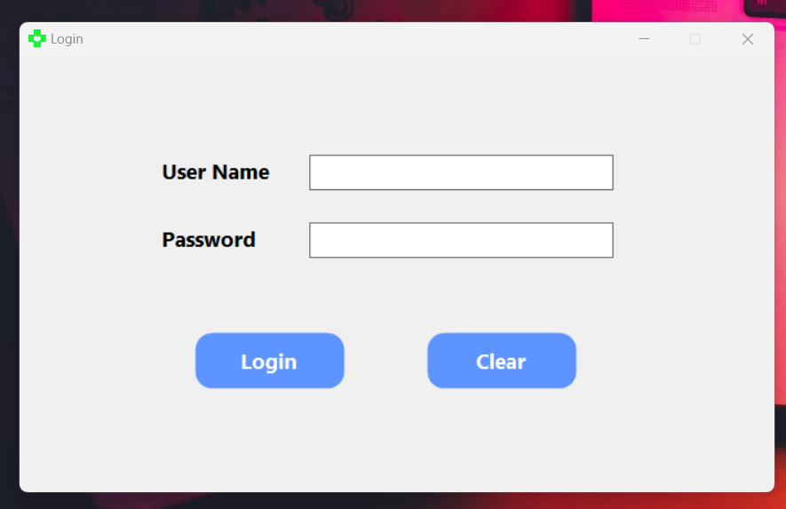

# HealthGuard - Pharmacy Management System

HealthGuard is a comprehensive Pharmacy Management System developed to streamline pharmacy operations, enhance accuracy, and improve healthcare service delivery. It empowers administrators and pharmacists with powerful tools to manage medicines, process prescriptions, track inventory, and generate bills,all through a secure and user-friendly interface.

---

## 📖 Project Description

In today’s healthcare landscape, pharmacists play a vital role in ensuring patient safety and proper medication management. HealthGuard addresses the daily challenges faced by pharmacy staff, such as managing inventory and processing complex transactions, by providing a robust digital solution. Designed using the Model-View-Controller (MVC) pattern, this system includes separate modules for Administrators and Pharmacists, each optimized for their unique workflows.

---

## ⭐ Main Features

### 👤 **Administrator Module**
- Add, update, search, and delete users (Admins/Pharmacists)
- Monitor system usage and user statistics
- Manage secure logins and sessions

### 💊 **Pharmacist Module**
- Add, update, search, and delete medicines
- Check medicine validity and expiry
- Issue bills and process medicine sales
- Real-time inventory management

---

## 🤝 Team Collaboration

This project was developed by a group of final-year students from the **Department of Information and Communication Technology, Faculty of Technology, University of Sri Jayewardenepura, Sri Lanka**, under the supervision of **Mrs. Sankani Heenkenda**.

### 👨‍💻 Team Members
- G.S. Chamika  
- W.W. Anjana Hemal  
- J. Jeyakumar  
- M. Nirupan  
- D.C. Ukwaththage  
- M. Pennikin  
- W.G.T.H.M.D. Rangana Bandara  

---

## 🖼️ Project Screenshots

| Login Page | Admin Dashboard | Pharmacist Dashboard |
|------------|------------------|-----------------------|
|  |  |  |

---

## 🖥️ System Setup

A precompiled setup executable (`HealthGuardSetup.exe`) is available in the repository under the `releases` section.

### ✅ Requirements
- Windows OS
- .NET Framework installed
- Microsoft SQL Server

### 🚀 Installation Steps
1. Download the `HealthGuardSetup.exe` file.
2. Run the installer and follow the on-screen instructions.
3. Ensure the SQL Server is properly configured with the provided DB scripts.
4. Launch the application and log in as Admin or Pharmacist.

---
